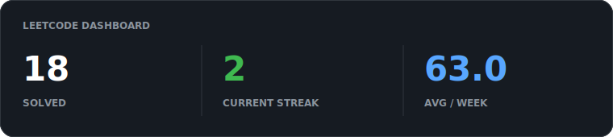
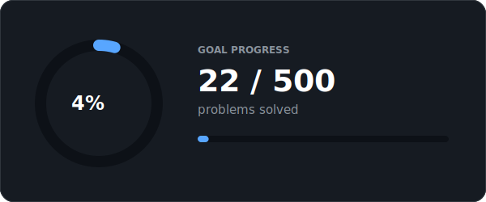
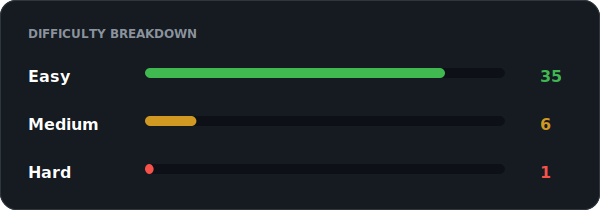
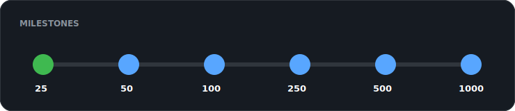

<p align="center"></p>

<p align="center">A premium, self-updating collection of algorithm solutions built with Python.</p>

<p align="center"></p>

## Overview

<p align="center"> </p>

<p align="center"> </p>

## Road to 500

<p align="center"></p>

**41 solved** · 8.2% complete · First solve: 2026-07-16 · Latest: 2026-07-20

## Latest solved

| # | Problem | Difficulty | Solved |
| --- | --- | --- | --- |
| `3760` | [Maximum Substrings With Distinct Start](solutions/python/medium/3760_maximum_substrings_with_distinct_start.py) | Medium | 2026-07-20 |
| `0383` | [Ransom Note](solutions/python/easy/0383_ransom_note.py) | Easy | 2026-07-20 |
| `0374` | [Guess Number Higher or Lower](solutions/python/easy/0374_guess_number_higher_or_lower.py) | Easy | 2026-07-20 |
| `0367` | [Valid Perfect Square](solutions/python/easy/0367_valid_perfect_square.py) | Easy | 2026-07-20 |
| `0350` | [Intersection of Two Arrays II](solutions/python/easy/0350_intersection_of_two_arrays_ii.py) | Easy | 2026-07-20 |
| `2864` | [Maximum Odd Binary Number](solutions/python/easy/2864_maximum_odd_binary_number.py) | Easy | 2026-07-19 |
| `1075` | [Project Employees I](solutions/mysql/easy/1075_project_employees_i.sql) | Easy | 2026-07-19 |
| `0349` | [Intersection of Two Arrays](solutions/python/easy/0349_intersection_of_two_arrays.py) | Easy | 2026-07-19 |

## Topics

_Add a solution to get started._

## Automation

Add a solution with the required metadata header, then run:

```powershell
.\.venv\Scripts\python.exe sync.py
```

This refreshes the JSON data, SVG dashboard, and README, then commits and pushes when a GitHub remote is configured. See [`data/config.json`](data/config.json).

## Contributions

Every synced solution becomes a commit. For GitHub contribution squares, use an email linked to your GitHub account, push to the default branch, and keep the repository public (or enable private contributions in GitHub settings).
