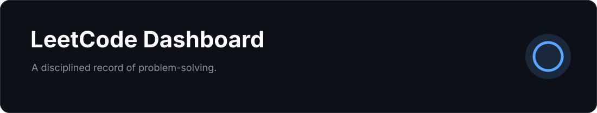
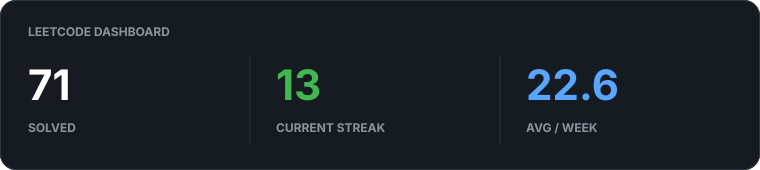
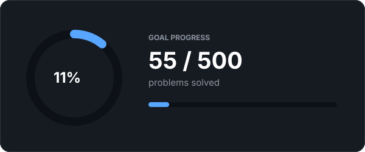
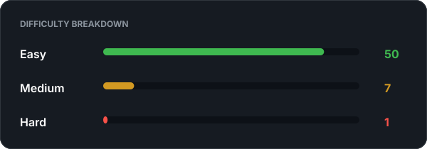
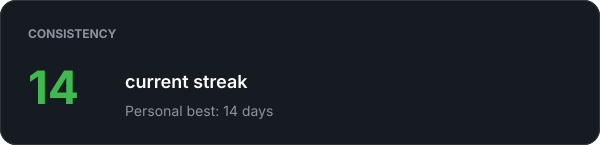
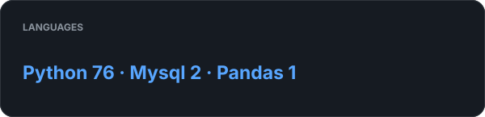
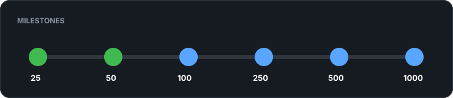

<p align="center"></p>

<p align="center">A premium, self-updating collection of algorithm solutions built with Python.</p>

<p align="center"></p>

## Overview

<p align="center"> </p>

<p align="center"> </p>

## Road to 500

<p align="center"></p>

**77 solved** · 15.4% complete · First solve: 2026-07-16 · Latest: 2026-08-13

## Latest solved

| # | Problem | Difficulty | Solved |
| --- | --- | --- | --- |
| `3516` | [Find Closest Person](solutions/python/easy/3516_find_closest_person.py) | Easy | 2026-08-13 |
| `3300` | [Minimum Element After Replacement With Digit Sum](solutions/python/easy/3300_minimum_element_after_replacement_with_digit_sum.py) | Easy | 2026-08-13 |
| `1941` | [Check if All Characters Have Equal Number of Occurrences](solutions/python/easy/1941_check_if_all_characters_have_equal_number_of_occurrences.py) | Easy | 2026-08-10 |
| `1510` | [Stone Game IV](solutions/python/hard/1510_stone_game_iv.py) | Hard | 2026-08-10 |
| `3921` | [Score Validator](solutions/python/easy/3921_score_validator.py) | Easy | 2026-08-08 |
| `3550` | [Smallest Index With Digit Sum Equal to Index](solutions/python/easy/3550_smallest_index_with_digit_sum_equal_to_index.py) | Easy | 2026-08-07 |
| `3360` | [Stone Removal Game](solutions/python/easy/3360_stone_removal_game.py) | Easy | 2026-08-06 |
| `3345` | [Smallest Divisible Digit Product I](solutions/python/easy/3345_smallest_divisible_digit_product_i.py) | Easy | 2026-08-06 |

## Topics

_Add a solution to get started._

## Automation

Add a solution with the required metadata header, then run:

```powershell
.\.venv\Scripts\python.exe sync.py
```

This refreshes the JSON data, SVG dashboard, and README, then commits and pushes when a GitHub remote is configured. See [`data/config.json`](data/config.json).

## Contributions

Every synced solution becomes a commit. For GitHub contribution squares, use an email linked to your GitHub account, push to the default branch, and keep the repository public (or enable private contributions in GitHub settings).
